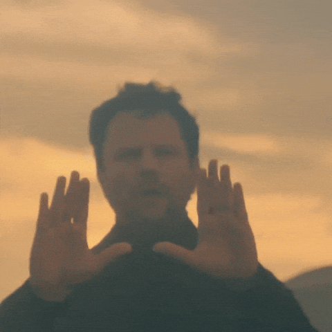

    

  
  
  <a>
    
  <a>
       

# 💻 Sobre mim

    Meu nome é Lilian, sou formada em <strong>Análise e Desenvolvimento de Sistemas (2021)</strong> e estou em busca de uma oportunidade como <strong>Desenvolvedora Júnior</strong>.
    Participei do programa <strong>Transforme-se da Serasa Experian</strong> e sou apaixonada por tecnologia, sempre pensando em ideias que possam ajudar as pessoas por meio dela.

    
    Aqui no GitHub compartilho meus projetos pessoais e registro meu crescimento na área de desenvolvimento.
    Tenho maior familiaridade com Backend, mas também estou expandindo meus conhecimentos em outras áreas para me tornar uma desenvolvedora cada vez mais completa.

<table align="center">
    <tr>
      <td></td>
      <td> </td>
    </tr>
</table>

# ⭐ Hard Skills 

    

### Principais Projetos
- [Lista de filmes](https://github.com/lilianlacerda/NewFilmList)
- [MyMetas -  Projeto Transforme-se](https://github.com/Transforme-se/ProjetoPI) 

# Minhas curiosidades
- 🎬 Amo filmes, principalmente nacionais, terror e romance. 
- 🎧 Música e podcasts me acompanham o tempo todo.  
- 🧵 Estou me aventurando no bordado, um desafio que me acalma.  
- 🧩 Sei montar cubo mágico, mas preciso melhorar o tempo 😅
- 🔢 Amo sudoku, cripto e qualquer passatempo de lógica.

<table align="center">
    <tr>
      <td></td>
      <td> </td>
      <td> </td>
    </tr>
</table>    

***

    

